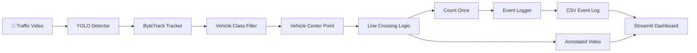

# 🚗 Vehicle Counting & Flow Analysis

<p align="center">
  <strong>Real-time vehicle detection, tracking, and line-crossing analytics using YOLO + ByteTrack + Streamlit.</strong>
</p>

<p align="center">
  
  
  
  
  
  
</p>

---

## 📌 Overview

**Vehicle Counting & Flow Analysis** is a computer vision system designed to automatically detect, track, and count vehicles crossing a predefined virtual line in fixed-camera traffic footage.

The system combines:

- **YOLO** for vehicle detection
- **ByteTrack** for multi-object tracking
- **State-based line-crossing logic** for reliable counting
- **CSV event logging** for structured analytics
- **OpenCV** for video processing and annotation
- **Streamlit** for an interactive analytics dashboard
- **Docker** for reproducible deployment

The primary goal is not simply detecting vehicles, but maintaining consistent tracking identities and ensuring that each vehicle is counted **once per valid crossing event**.

---

# ✨ Key Features

| Feature | Description |
|---|---|
| 🎯 Vehicle Detection | Detects vehicles frame-by-frame using a pretrained YOLO model |
| 🆔 Multi-Object Tracking | Maintains tracking IDs using ByteTrack |
| 🚗 Vehicle Filtering | Supports cars, trucks, buses, and motorcycles |
| 📏 Line Crossing | Counts vehicles crossing the provided virtual line |
| 🔁 Duplicate Prevention | Prevents the same tracked vehicle from being counted repeatedly |
| 📝 Event Logging | Stores crossing events with timestamps and vehicle metadata |
| 🎥 Video Annotation | Generates an annotated output video |
| 📊 Analytics Dashboard | Interactive Streamlit interface for results and statistics |
| 🧪 Automated Testing | Includes tracker and counter robustness tests |
| 🐳 Docker Deployment | Fully containerized application |
| 📥 CSV Export | Allows event data to be downloaded for further analysis |

---

# 🧠 System Architecture



### Processing Pipeline

```text
Input Video
     │
     ▼
┌───────────────┐
│ YOLO Detector │
└───────┬───────┘
        │
        ▼
┌────────────────┐
│ ByteTrack      │
│ Object Tracker │
└───────┬────────┘
        │
        ▼
┌──────────────────┐
│ Vehicle Filtering│
└────────┬─────────┘
         │
         ▼
┌────────────────────┐
│ Center Point       │
│ Calculation        │
└─────────┬──────────┘
          │
          ▼
┌────────────────────┐
│ Line Crossing      │
│ State Machine      │
└─────────┬──────────┘
          │
          ├──────────────► 📊 Count
          │
          ├──────────────► 📝 Event Log
          │
          └──────────────► 🎥 Annotated Video
```

---

# 🎯 Problem Definition

Given a fixed-camera traffic video, the system must:

1. Detect vehicles in each frame.
2. Track vehicles across consecutive frames.
3. Use the predefined virtual counting line.
4. Detect valid vehicle crossings.
5. Count each tracked vehicle only once.
6. Record crossing events with timestamps.
7. Generate an annotated output video.
8. Present the results through an accessible interface.

The system focuses on **event-based vehicle counting**, rather than long-term real-world identity recognition.

---

# 🚘 Supported Vehicle Classes

The tracker currently accepts the following classes:

```text
car
truck
bus
motorcycle
```

Non-vehicle objects such as:

```text
person
bicycle
cat
dog
```

are ignored by the vehicle filtering stage.

This prevents unrelated detections from affecting the final vehicle count.

---

# 📏 Line Crossing Logic

The evaluation video provides a predefined virtual counting line:

```text
Start Point : (220, 420)
End Point   : (1080, 420)

Direction   : top_to_bottom
```

The system does not manually choose a final counting line.

### Counting Strategy

A vehicle is considered a valid crossing when:

```text
Vehicle moves sufficiently above the line
                ↓
      Tracking state recorded
                ↓
Vehicle moves sufficiently below the line
                ↓
        Valid crossing event
                ↓
        Count vehicle once
```

A configurable **crossing zone** is used around the line to reduce unstable counts caused by small frame-to-frame movements near the boundary.

---

# 🔄 Duplicate Count Prevention

One of the important engineering challenges in vehicle counting is preventing repeated counts.

A tracked vehicle can remain near the counting line for multiple frames:

```text
Frame 1  → Above line
Frame 2  → Near line
Frame 3  → Below line
Frame 4  → Near line
Frame 5  → Below line
```

Simply checking whether the vehicle touches the line can result in multiple counts.

Instead, the system maintains state for every tracking ID.

Conceptually:

```python
track_state[track_id] = {
    "has_been_above": True
}
```

Once a vehicle has crossed successfully, its tracking ID is stored:

```python
counted_ids
```

Therefore:

```text
Same vehicle
     ↓
Multiple frames
     ↓
Multiple line interactions
     ↓
Only ONE valid count
```

This makes the counting logic more robust against boundary oscillation.

---

# 📊 Evaluation Results

The system was tested on the provided traffic video.

### Input Video

| Property | Value |
|---|---:|
| Duration | 60 seconds |
| Resolution | 1280 × 720 |
| Frame Rate | 50 FPS |
| Total Frames | 3000 |
| Direction | Top → Bottom |

### Final Count

## **31 Vehicles**

| Vehicle Type | Count |
|---|---:|
| 🚗 Car | 29 |
| 🏍️ Motorcycle | 1 |
| 🚚 Truck | 1 |
| 🚌 Bus | 0 |
| **Total** | **31** |

### Generated Outputs

The pipeline produces:

```text
outputs/
├── logs/
│   └── events.csv
│
└── videos/
    └── cars_annotated.mp4
```

The event log contains:

```text
video_name
timestamp_seconds
event_type
vehicle_class
track_id
direction
```

Example:

```csv
video_name,timestamp_seconds,event_type,vehicle_class,track_id,direction
cars.mp4,12.48,vehicle_crossed,car,17,top_to_bottom
cars.mp4,15.72,vehicle_crossed,truck,23,top_to_bottom
```

---

# 🖥️ Streamlit Dashboard

The project includes a Streamlit-based analytics interface designed to provide a simple way to process the video and inspect the results.

### 📹 Input Video

Displays the source traffic footage.

### ▶️ Processing

Runs the complete vehicle detection, tracking, counting, and logging pipeline.

### 📈 Analytics

Displays:

- Total vehicle count
- Vehicle-type breakdown
- Event statistics
- Vehicle distribution chart

### 🎥 Annotated Output

Displays the generated video with detection boxes, tracking information, and counting results.

### 📥 Event Export

The generated event log can be downloaded as a CSV file for further analysis.

---

# 🧪 Testing

The project includes automated tests for important counting and tracking behaviours.

## Counter Tests

The following scenarios are tested:

- ✅ Single vehicle crossing
- ✅ Vehicle that does not cross
- ✅ Multiple vehicle crossings
- ✅ Duplicate count prevention

Example result:

```text
Test A - Single vehicle crossing: PASSED
Test B - Vehicle does not cross: PASSED
Test C - Multiple vehicles: PASSED
Test D - Duplicate count prevention: PASSED

All counter robustness tests: PASSED
```

## Tracker Tests

The tracker filtering tests verify that supported vehicle classes are accepted while non-vehicle classes are rejected.

```text
Allowed:
✓ car
✓ truck
✓ bus
✓ motorcycle

Rejected:
✓ person
✓ bicycle
✓ cat
✓ dog
```

Run the tests with:

```bash
python tests/test_counter.py
python tests/test_tracker.py
```

---

# 🐳 Docker Deployment

The application is containerized using Docker to provide a reproducible deployment environment.

## Build the Image

```bash
docker build -t vehicle-counting .
```

## Run with Docker

The challenge video and YOLO model weights are intentionally excluded from GitHub.

They can be mounted into the container at runtime.

### Windows PowerShell

```powershell
docker run --rm -p 8502:8501 `
  -v "${PWD}\video:/app/video" `
  -v "${PWD}\yolo11n.pt:/app/yolo11n.pt" `
  vehicle-counting
```

Then open:

```text
http://localhost:8502
```

### Why are these files mounted?

The following files are intentionally excluded from version control:

```text
video/
*.pt
```

This keeps the repository lightweight and avoids committing large challenge assets and model weights.

---

# ⚙️ Local Setup

## 1. Clone the Repository

```bash
git clone https://github.com/ANUSHKAD1/Vehicle-Counting.git
cd Vehicle-Counting
```

## 2. Create a Virtual Environment

### Windows

```powershell
python -m venv venv
venv\Scripts\activate
```

## 3. Install Dependencies

```bash
pip install -r requirements.txt
```

## 4. Provide Required Assets

Place the evaluation video at:

```text
video/cars.mp4
```

Place the YOLO model weights at:

```text
yolo11n.pt
```

The model weights and challenge video are intentionally excluded from Git.

---

# ▶️ Running the Application

Start the Streamlit application with:

```bash
python -m streamlit run app.py
```

Then open:

```text
http://localhost:8501
```

---

# 🔬 Running the Processing Pipeline

The complete processing pipeline can also be executed directly:

```bash
python -m src.processor
```

The pipeline performs:

```text
Read Video
    ↓
Detect Vehicles
    ↓
Track Vehicles
    ↓
Filter Vehicle Classes
    ↓
Calculate Vehicle Center
    ↓
Check Line Crossing
    ↓
Count Valid Crossings
    ↓
Write Event Log
    ↓
Generate Annotated Video
```

---

# 📁 Project Structure

```text
vehicle-counting/
│
├── config/
│   └── config.yaml
│
├── src/
│   ├── __init__.py
│   ├── video_utils.py
│   ├── detector.py
│   ├── tracker.py
│   ├── counter.py
│   ├── logger.py
│   └── processor.py
│
├── tests/
│   ├── __init__.py
│   ├── test_counter.py
│   ├── test_detector.py
│   ├── test_tracker.py
│   └── test_logger.py
│
├── app.py
├── Dockerfile
├── .dockerignore
├── .gitignore
├── requirements.txt
├── README.md
│
├── video/                  # Local challenge data - not committed
│   └── cars.mp4
│
├── yolo11n.pt              # Local model weights - not committed
│
└── outputs/                # Generated outputs - not committed
    ├── logs/
    └── videos/
```

---

# 🛠️ Technology Stack

| Technology | Purpose |
|---|---|
| 🐍 Python | Core implementation |
| 🎯 YOLO | Object detection |
| 🆔 ByteTrack | Multi-object tracking |
| 🎥 OpenCV | Video processing and annotation |
| 🔢 NumPy | Numerical operations |
| 🐼 Pandas | Data analysis and dashboard processing |
| 📊 Streamlit | Interactive web interface |
| 🎞️ FFmpeg | Video encoding |
| 🐳 Docker | Containerized deployment |
| 🔥 PyTorch | Deep learning backend |

---

# 🏗️ Engineering Decisions

## Why YOLO?

A pretrained YOLO model provides fast and effective object detection without requiring model training from scratch.

## Why ByteTrack?

Detection alone does not provide persistent identities between frames.

ByteTrack associates detections across frames, allowing the system to maintain a tracking ID for each detected vehicle.

## Why Tracking IDs?

The counting system needs to determine whether a vehicle has already generated a crossing event.

Tracking IDs provide a lightweight mechanism for maintaining this state without requiring real-world identity recognition.

## Why State-Based Counting?

Checking only whether a vehicle is near the line can produce unstable or duplicate events.

The state-based approach requires a vehicle to first establish its position above the line before accepting a transition to below the line.

This reduces duplicate counting caused by small positional fluctuations around the boundary.

---

# 🔐 Design Constraints

The system intentionally avoids:

- ❌ Face recognition
- ❌ Real-world vehicle identity recognition
- ❌ Long-term identity matching
- ❌ Manual hardcoding of final vehicle counts
- ❌ Training a custom model from scratch

The tracking IDs are temporary identifiers used internally by ByteTrack for the counting process.

---

# ⚠️ Limitations

The current system is designed for fixed-camera traffic footage and has several practical limitations:

- Heavy occlusion can affect tracking continuity.
- Very small or partially visible vehicles may be missed.
- Detection quality depends on the pretrained model.
- Tracking IDs are temporary identifiers and are not real-world vehicle identities.
- The current configuration focuses on **top-to-bottom** crossings.
- Performance can vary depending on available hardware and video resolution.

These limitations are expected in practical computer vision systems and provide opportunities for future improvement.

---

# 🚀 Future Improvements

Potential extensions include:

- ↔️ Bidirectional vehicle counting
- 🚦 Direction-wise traffic analytics
- 📊 Time-based traffic flow charts
- 📁 JSON event export
- ⚡ GPU-accelerated inference
- 🔧 Configurable detection thresholds
- 📈 Real-time FPS and processing metrics
- 🛣️ Multiple virtual counting lines
- ☁️ Cloud deployment
- 🔌 REST API using FastAPI

---

# 📌 Project Status

```text
┌─────────────────────────────────────────────┐
│          VEHICLE COUNTING SYSTEM            │
├─────────────────────────────────────────────┤
│                                             │
│  Detection              ✅ Complete         │
│  Tracking               ✅ Complete         │
│  Vehicle Filtering      ✅ Complete         │
│  Line Crossing          ✅ Complete         │
│  Duplicate Prevention   ✅ Complete         │
│  Event Logging          ✅ Complete         │
│  Annotated Video        ✅ Complete         │
│  Robustness Tests       ✅ Complete         │
│  Streamlit Dashboard    ✅ Complete         │
│  Docker Deployment      ✅ Complete         │
│                                             │
└─────────────────────────────────────────────┘
```

---

# 💡 What This Project Demonstrates

This project demonstrates an end-to-end computer vision workflow:

```text
Computer Vision
      │
      ├── Object Detection
      │
      ├── Multi-Object Tracking
      │
      ├── Event-Based Counting
      │
      ├── Data Logging
      │
      ├── Video Analytics
      │
      ├── Automated Testing
      │
      ├── Interactive Visualization
      │
      └── Containerized Deployment
```

The architecture is intentionally modular so that individual components can be improved or replaced without redesigning the entire system.

---

# 📄 Challenge Deliverables

The project provides the core deliverables required for the vehicle-counting challenge:

- ✅ Source code repository
- ✅ Vehicle detection pipeline
- ✅ Multi-object tracking
- ✅ Vehicle-class filtering
- ✅ Virtual line-crossing counting
- ✅ Duplicate-count prevention
- ✅ Event logs
- ✅ Annotated output video
- ✅ Interactive Streamlit interface
- ✅ Dockerized deployment
- ✅ Automated robustness tests
- ✅ Project documentation

---

# 👨‍💻 Development Philosophy

The project follows a modular engineering approach where detection, tracking, counting, logging, and presentation are separated into independent components.

This makes the system:

**Modular** — components can be replaced independently.

**Testable** — core counting behaviour can be validated separately.

**Maintainable** — responsibilities are separated across modules.

**Deployable** — the application can run locally or inside Docker.

**Extensible** — additional analytics can be added without redesigning the entire pipeline.

---

<p align="center">
  <strong>Built with Python • YOLO • ByteTrack • OpenCV • Streamlit • Docker</strong>
</p>

<p align="center">
  🚗 <i>Detect. Track. Count. Analyze.</i> 🚗
</p>